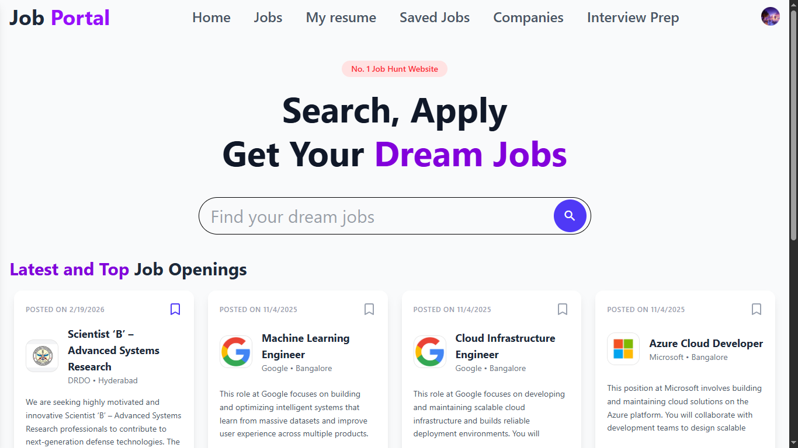
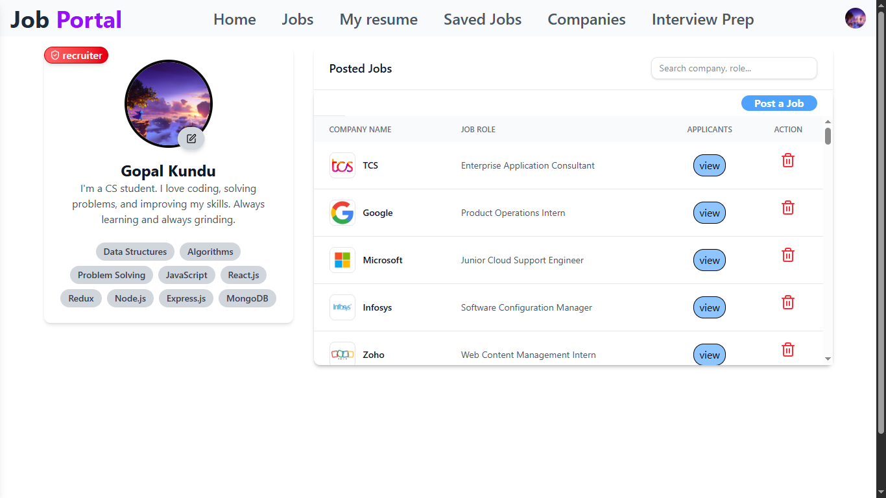
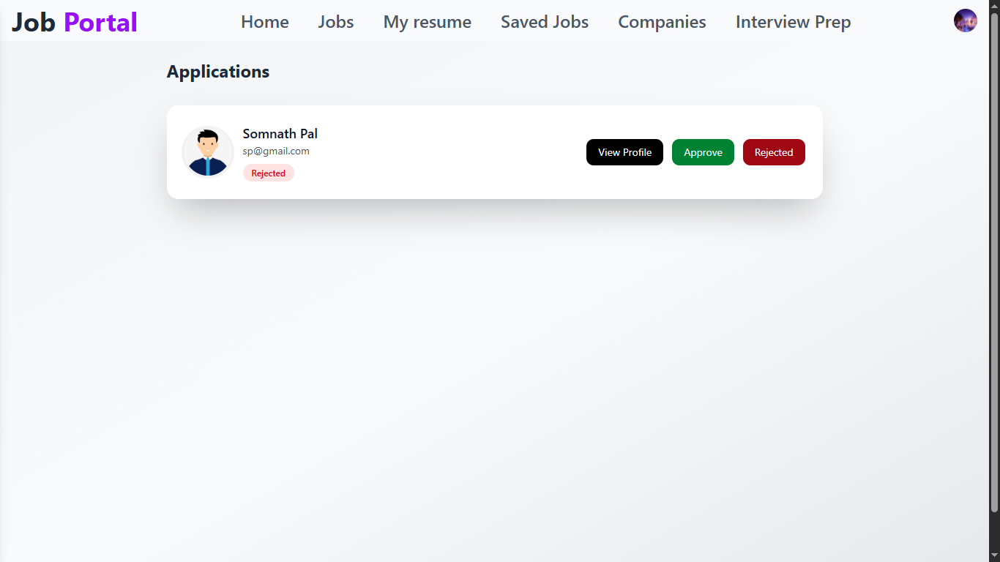
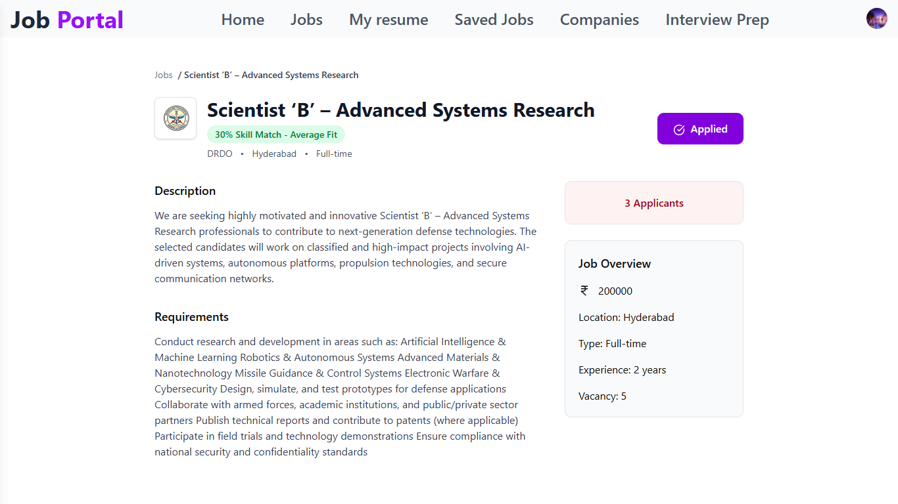
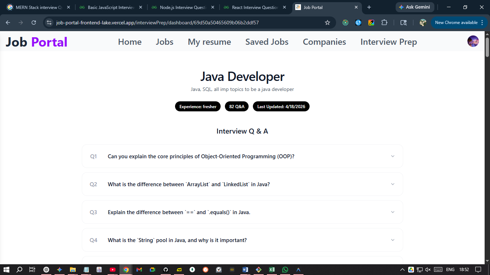
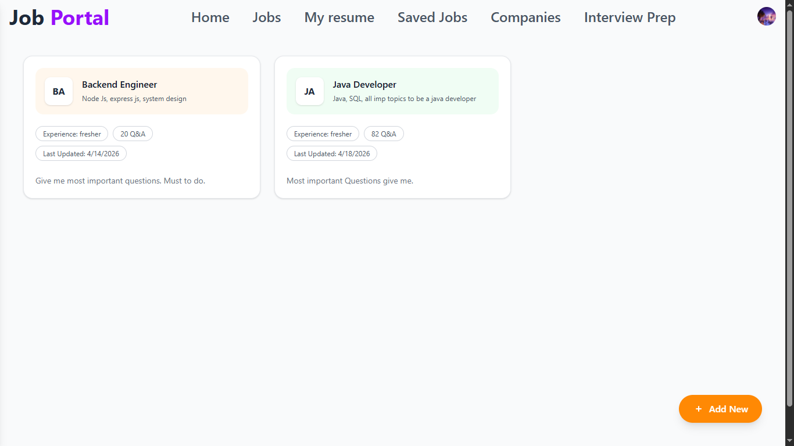
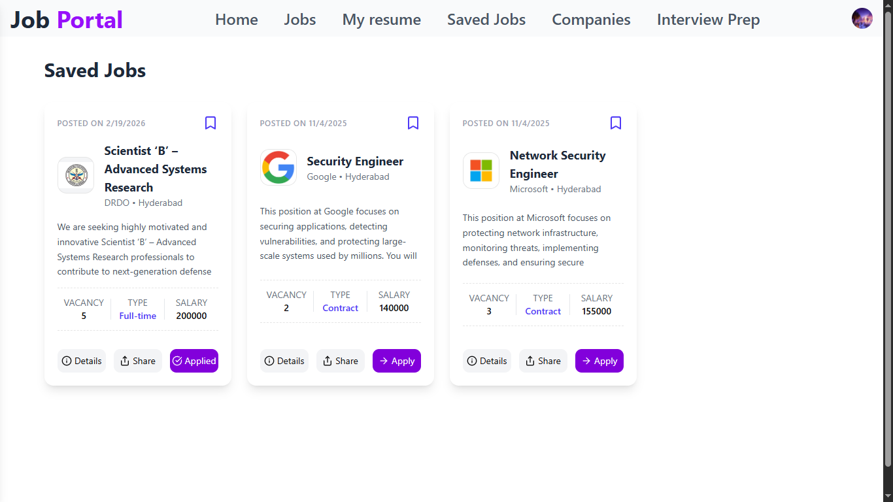

# Job Portal WebApp

A comprehensive, full-stack Job Portal Web Application designed to connect job seekers and recruiters seamlessly. Built with the MERN stack, this application leverages AI to enhance the hiring process, featuring an intuitive recruiter dashboard, AI-powered job fit analysis, and intelligent interview question generation.

## 🌟 Key Features

- **AI-Powered Job Fit**: Automatically evaluate how well an applicant's profile matches a job description using Google GenAI.
- **Intelligent Interview Questions**: Generate relevant, role-specific interview questions on the fly with AI.
- **Recruiter Dashboard**: An intuitive hub for recruiters to manage job postings, track applicant statuses, and streamline hiring.
- **Job Seeker Experience**: Effortlessly browse jobs, save favorites for later, and apply with a single click.
- **Real-Time Responsiveness**: A beautiful, mobile-friendly interface with smooth animations and transitions.

## 🛠️ Tech Stack

### Frontend
- **React.js & Vite**: Lightning-fast development and optimized build.
- **Redux Toolkit**: Efficient state management.
- **Tailwind CSS & Material UI**: Modern, responsive, and accessible styling.
- **Framer Motion**: Smooth micro-interactions and animations.

### Backend
- **Node.js & Express.js**: Robust API architecture.
- **MongoDB & Mongoose**: Flexible and scalable database.
- **Google GenAI**: Integrated artificial intelligence for advanced hiring insights.
- **Cloudinary & Multer**: Seamless image and resume uploading.
- **JWT & bcrypt**: Secure authentication and authorization.

## 📸 Previews

### Home Screen


### Recruiter's Dashboard


### Applicants for Job


### Job Description with AI Job Fit


### Interview Question Page


### Generate Interview Question Section


### Saved Jobs Page


## 🚀 Getting Started

### Prerequisites
- Node.js (v18+)
- MongoDB Atlas or local MongoDB server
- Cloudinary Account
- Google Gemini API Key

### Installation

1. **Clone the repository**
   ```bash
   git clone <your-repository-url>
   cd "Job Portal"
   ```

2. **Backend Setup**
   ```bash
   cd backend
   npm install
   ```
   Create a `.env` file in the `backend` directory and add the following variables:
   ```env
   PORT=8000
   MONGO_URI=your_mongodb_connection_string
   JWT_SECRET=your_jwt_secret
   CLOUDINARY_CLOUD_NAME=your_cloudinary_name
   CLOUDINARY_API_KEY=your_cloudinary_api_key
   CLOUDINARY_API_SECRET=your_cloudinary_api_secret
   GEMINI_API_KEY=your_google_genai_api_key
   ```

3. **Frontend Setup**
   ```bash
   cd ../frontend
   npm install
   ```
   Create a `.env` file in the `frontend` directory and add your frontend variables:
   ```env
   VITE_API_URL=http://localhost:8000
   ```

4. **Run the Application**

   Start the Backend:
   ```bash
   cd backend
   npm run dev
   ```

   Start the Frontend:
   ```bash
   cd frontend
   npm run dev
   ```
