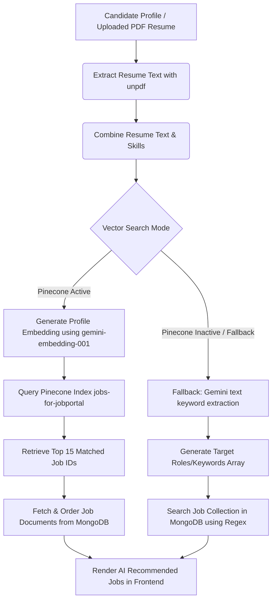
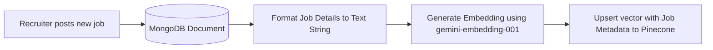
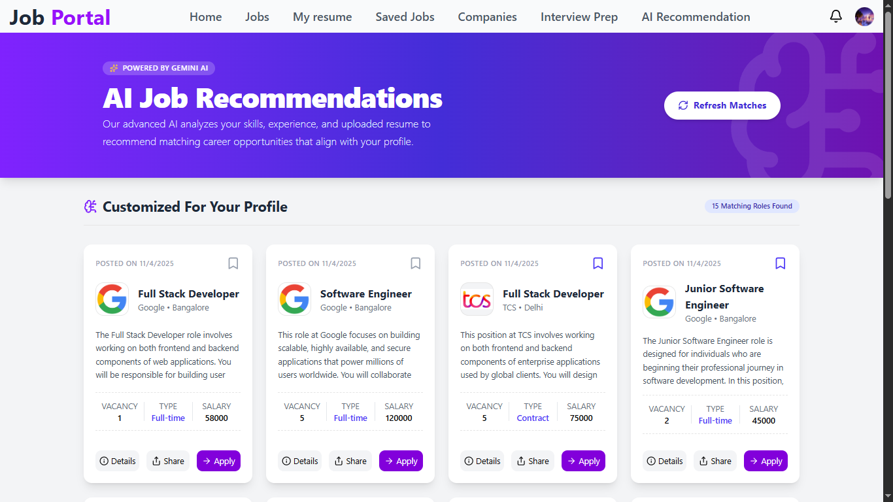

# 💼 AI-Recruitment-Platform

An advanced, full-stack Job Portal Web Application designed to connect job seekers and recruiters through an intelligent, AI-driven hiring pipeline. The platform integrates **Google Gemini AI** and **Pinecone Vector Database** to deliver semantic search recommendations, automated resume optimizing, precise job-fit matching, and dynamic interview preparations.

---

## 🚀 Key Highlights & AI Capabilities

### 1. AI Recommendation System (Pinecone Vector DB + Gemini Embeddings)
Rather than relying on basic keyword searches, the portal utilizes state-of-the-art semantic search to recommend relevant jobs to applicants:
* **Embedded Candidate Profiles**: Combines applicant's listed skills and extracted PDF resume text.
* **Gemini Embeddings**: Vectorizes the combined profile using Google GenAI's `gemini-embedding-001` model (configured at `368` dimensions for maximum query efficiency).
* **Pinecone Indexing**: Queries a high-performance vector index (`jobs-for-jobportal`) to retrieve the top matching jobs.
* **Auto-Sync & Lifecycle Management**: 
  * Jobs are instantly vectorized and upserted to Pinecone upon posting.
  * Deleting a job immediately purges it from the vector index.
  * Bulk synchronization is available for admins via the `/api/v1/jobs/sync-pinecone` endpoint.
* **Dual-Layer Fallback**: If the Pinecone search fails or key environment variables are missing, the system falls back to a Gemini-powered LLM parsing agent. It extracts matching role keywords from the resume and queries MongoDB using optimized regex operations.

#### System Architectures

**AI Recommendation Flow:**


**Job Creation & Index Sync:**


---

### 2. Job Description-Specific ATS Resume Suite
* **Resume Alignment & Gap Analysis**: Scans the candidate's uploaded resume PDF and evaluates it directly against a job description. Returns an initial ATS Score (0–100), summarizes core strengths, and highlights specific gaps (missing skills or formatting weaknesses).
* **Tailored ATS Resume Generation**: Rewrites candidate achievements using action-oriented language, incorporating quantifiable metrics and matching terminology to boost the applicant tracking system score to 95+.
* **Interactive Resume JSON Editor**: Allows users to preview and refine their custom ATS resume JSON directly in the browser and auto-optimize bullet points using AI.
* **Puppeteer PDF Downloader**: Renders the JSON resume schema into a clean, single-page, ATS-compliant HTML structure and generates a downloadable PDF server-side.
* **Targeted YouTube Recommendations**: Generates tailored YouTube search queries and learning resources specifically targeting the candidate's identified skill gaps.

---

### 3. Additional AI Features
* **AI Job Fit Match Widget**: Evaluates candidate compatibility against specific job postings and displays a percentage rating.
* **Intelligent Interview Prep & Mock QA**: Instantly generates role-specific interview preparation packs containing questions, sample answers, difficulty levels, and flashcard modules. Offers a dynamic "generate more questions" prompt.

---

### 4. Recruiter & Student Hub
* **Unified Recruiter Dashboard**: Centralized panel displaying vacancies, application statistics, and job posting history.
* **Application Lifecycle Management**: Recruiters can review applicants, accept/reject candidates, and trigger automated in-app notifications carrying company logos.
* **Student Dashboard**: Browse jobs with paginated filters (job type, location, vacancy thresholds, salary range, and salary sorting), save/bookmark jobs, and track application statuses.

---

## 🛠️ Tech Stack

### Frontend
* **React.js & Vite**: Ultra-fast build tool and rendering engine.
* **Redux Toolkit**: Centralized state management for authentication, dashboard data, and recommended jobs cache.
* **Tailwind CSS & Material UI**: Sleek styling, glassmorphism components, responsive layout systems, and skeleton loader effects.
* **Framer Motion**: Smooth animations, hover micro-interactions, and panel transitions.
* **Lucide React**: Clean iconography.

### Backend
* **Node.js & Express.js**: Asynchronous REST API server.
* **MongoDB & Mongoose**: Object-document modeling for users, jobs, companies, notifications, and tailored resumes.
* **Google GenAI SDK**: Integrations for content generation (`gemini-3.1-flash-lite`) and embeddings (`gemini-embedding-001`).
* **Pinecone Database**: High-speed, low-latency vector similarity database.
* **Puppeteer Core**: Server-side headless Chrome generation for export-ready PDFs.
* **Cloudinary & Multer**: Multipart form data handling and cloud-based media storage for resumes and company logos.
* **JWT & bcryptjs**: Secure cookie-based sessions, tokens, and hashed passwords.

---

## 📸 Previews

### Home Screen


### AI Job Recommendation


### Recruiter's Dashboard


### Applicants for Job


### Job Description with AI Job Fit


### Interview Question Page


### Generate Interview Question Section


### Saved Jobs Page


---

## 🚀 Getting Started

### Prerequisites
* Node.js (v18+)
* MongoDB Atlas or a running local MongoDB server
* Cloudinary Account
* Google Gemini API Key
* Pinecone API Key

### Installation

1. **Clone the Repository**
   ```bash
   git clone <your-repository-url>
   cd "Job Portal"
   ```

2. **Backend Setup**
   ```bash
   cd backend
   npm install
   ```
   Create a `.env` file inside the `backend` directory and add:
   ```env
   PORT=8000
   MONGO_URI=your_mongodb_connection_string
   JWT_SECRET=your_jwt_secret
   CLOUDINARY_CLOUD_NAME=your_cloudinary_name
   CLOUDINARY_API_KEY=your_cloudinary_api_key
   CLOUDINARY_API_SECRET=your_cloudinary_api_secret
   GEMINI_API_KEY=your_google_genai_api_key
   PINECONE_API_KEY=your_pinecone_api_key
   PINECONE_INDEX=jobs-for-jobportal
   ```

3. **Frontend Setup**
   ```bash
   cd ../frontend
   npm install
   ```
   Create a `.env` file inside the `frontend` directory and add:
   ```env
   VITE_API_URL=http://localhost:8000
   ```

4. **Synchronize MongoDB Jobs with Pinecone (One-Time Execution)**
   Once the servers are running, access the synchronization endpoint as an authenticated user to load existing MongoDB job documents into your Pinecone Vector database:
   ```http
   GET http://localhost:8000/api/v1/jobs/sync-pinecone
   ```

---

## 💻 Running the Application

### Start the Backend Server:
```bash
cd backend
npm run dev
```

### Start the Frontend Client:
```bash
cd frontend
npm run dev
```

---

## 📂 Project Architecture

```text
├── backend
│   ├── Ai                  # Gemini model integrations and embedding configs
│   ├── controllers         # Route logic (users, jobs, companies, AI, ATS)
│   ├── middleware          # Authentication and role guards
│   ├── models              # Mongoose schemas (User, Job, Company, Notification, etc.)
│   ├── routes              # Route handlers
│   ├── utils               # Helper classes (Pinecone client utilities, PDF builders)
│   └── vercel.json         # Deployment configuration
│
└── frontend
    ├── public              # Static assets
    ├── src
    │   ├── components      # Pages, layouts, shared UI widgets
    │   ├── lib             # Utility libraries
    │   ├── redux           # Auth and job slices
    │   └── utils           # Helper addresses and config constants
```
