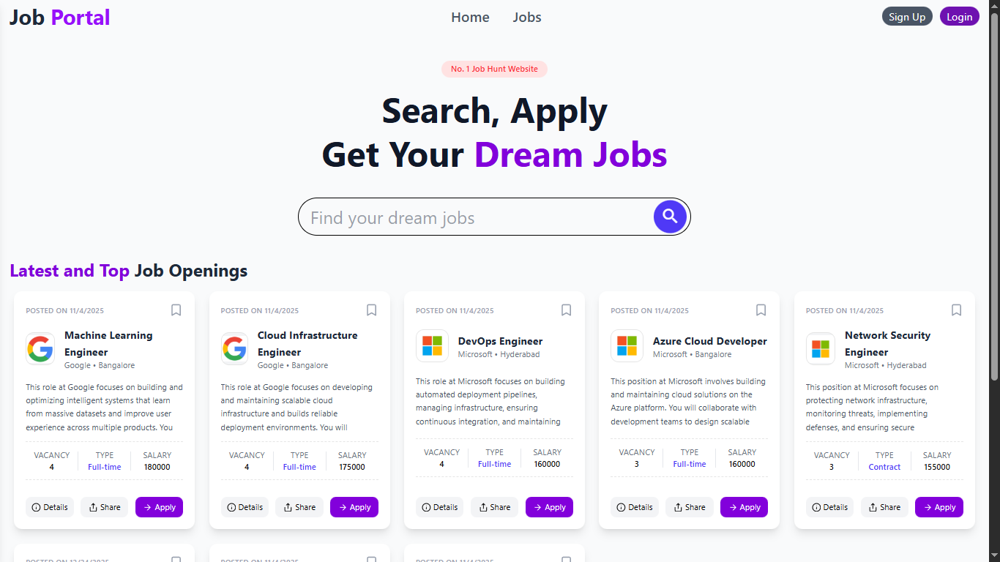
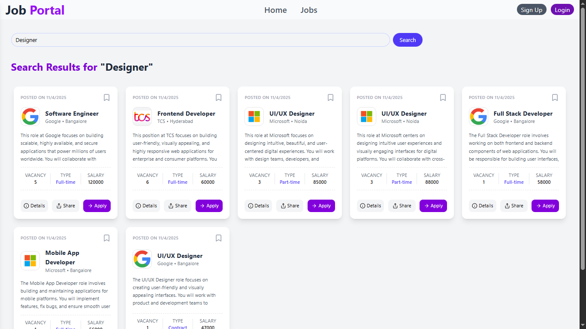
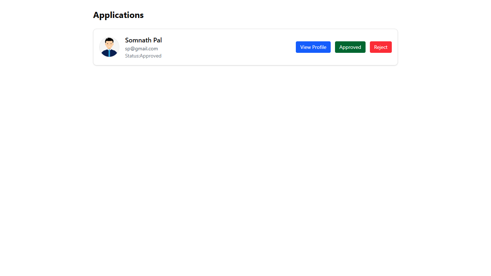
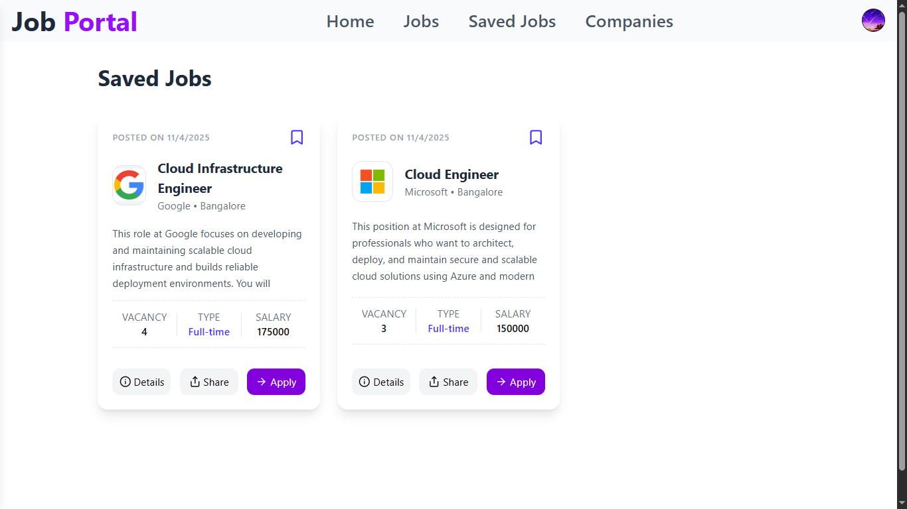
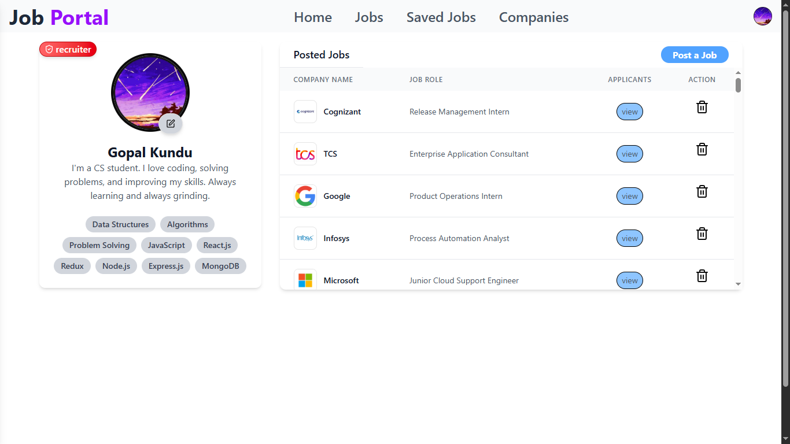

# Job Portal Project

## Description
A full-stack **Job Portal** for users to **apply for jobs**, **upload resumes**, and **post jobs**. Responsive for both desktop and mobile.

## Features
- User authentication (signup/login)  
- Employers can **post and manage jobs**  
- Job seekers can **apply and upload resumes**  
- Track application status  

## Tech Stack
**Frontend:** React.js, Redux, Tailwind CSS, Axios  
**Backend:** Node.js, Express.js, MongoDB Atlas, Mongoose, Bcrypt, JWT, Cookie-parser  
**APIs & Integrations:** RESTful APIs, Cloudinary (for file uploads)  
**Deployment:** Vercel / Render

## 📸 Screenshots

### 🏠 Home Page

### 🔍 Search Jobs

### 👤 Applicant Dashboard

### 💾 Saved Jobs

### 👤 Profile Page
